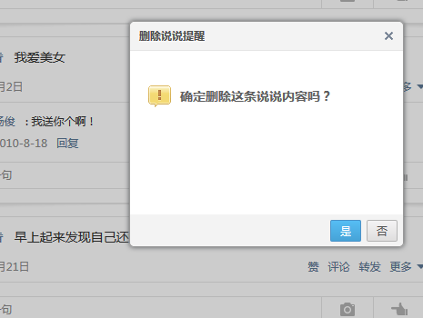

##　谁还没有点黑历史
###　在那个"少年不识愁滋味，为赋新词强说愁"的年纪里，我留下了许多“羞耻”的QQ空间说说，所以我写下了这个脚本批量删除说说

##　使用方法

###　第一步：打开你的QQ空间，选择说说

###　第二步：按F12键，打开控制台

###　第三步：把代码复制到这里（看图）

###　第四步：点击运行，看着你的说说被删除，然后告别那段青春（流泪.jpg
不用点确定，它自己会搞

###　其实呢也不一定要删对吧，再中二也是自己是吧，对吧（删了就找不回来了哦，我是没写把说说做备份的代码
